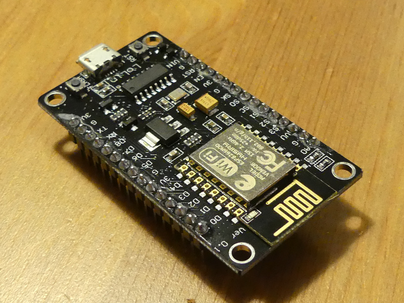
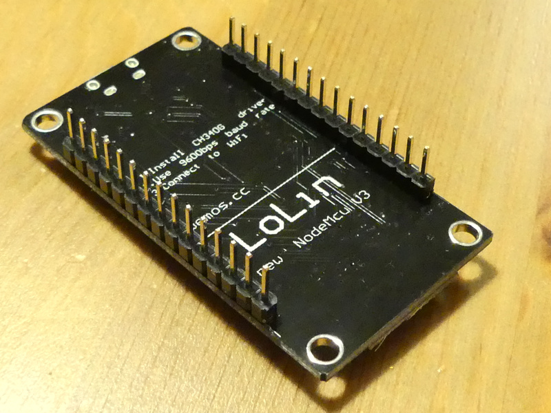
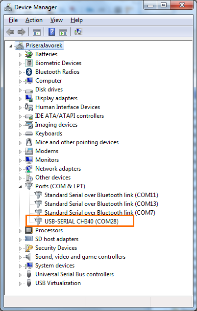

[← zpět na zápisky z Arduino projektů](../../index.md)
[← zpět na Maplebot](../maplebot.md)

# Flash firmware Micropythonu do NodeMCU (ESP8266)
_Tuto sekci jsem prováděl bez dětí. Flashování firmware není zrovna záživná záležitost. Nicméně jednou se k ní děti třeba vrátí, až si budou chtít přeflashovat svoje NodeMCU :-)_

* obsah
{:toc}
{::options toc_levels="2..4" /}

Pořídil jsem několik [NodeMCU devkitů](https://github.com/nodemcu/nodemcu-devkit-v1.0) šlapajících na ESP8266. Tyto čipy díky svému výkonu (v základu 80 MHz, [lze zvýšit až na 160 MHz](http://www.instructables.com/id/ESP8266-NodeMCU-CPU-Speed-Test/) - což i výkon zvýší asi dvojnásobně) zvládají nejen Wifi, ale i interpretované jazyky. Obvykle se nabízí ke koupi s předchystaným interpretem jazyka [Lua](https://www.lua.org/) (vlastně spíš [eLua](http://www.eluaproject.net/)), ale je možné jej vyměnit i za [Micropython](https://micropython.org/) nebo Arduino (programujeme pak v jazyce Wiring, který je velmi podobný C/C++).




Zvolil jsem nakonec Micropython. Nechtělo se mi učit jazyk Lua a C++ je zase trochu nemotorné pro výuku dětí. Má to své [výkonové dopady](http://esp8266freq.blogspot.cz/2016/12/esp-speed-compare-in-lua-micropython.html) (Lua je zhruba 20× pomalejší než C++, Micropython asi 10×), ale jsem s tím srozuměn a jdeme to zkusit. Vždy můžeme flashovat něco jiného.

> Tohle je návod, jak nahrát nový firmware právě do NodeMCU. Vlastní flash firmware jsem prováděl na Windows i Linux, návod popisuje obě platformy.

## Co je potřeba umět
* Trochu se orientovat v příkazové řádce

## Hardware
* NodeMCU devkit (ESP8266), použil jsem od výrobce Lolin ([Aliexpress](https://www.aliexpress.com/wholesale?catId=0&initiative_id=SB_20170926132515&SearchText=nodemcu))
* microUSB kabel

## Software
Aneb někdy taky toolchain. SW nářadí, které bude potřeba.
* [Driver NodeMCU](https://github.com/nodemcu/nodemcu-devkit/tree/master/Drivers)
* [Python](https://www.python.org/downloads/) (na Linuxu nejspíš už máte)
* [Esptool](https://github.com/espressif/esptool)
* [Micropython firmware](http://micropython.org/download#esp8266)

## Postup
### 1. Stáhnout  a nainstalovat [NodeMCU driver](https://github.com/nodemcu/nodemcu-devkit/tree/master/Drivers), aby ho rozpoznal operační systém
### 2. Připojit NodeMCU k počítači přes microUSB kabel
### 3. Zjistit, na jakém portu se objevil
**Windows** (nemám bohužel českou verzi)
* Control panels/Device manager
* Pod záložkou Ports (COM & LPT) najít, kde ho máme



**Linux**
``` shell
ls -l /dev/tty*
```
nebo ještě lépe
``` shell
dmesg | tail
```

### 4. Nainstalovat [Python](https://www.python.org/downloads/)
Brát verzi 3.x, na Linuxu velmi pravděpodobně už Python je. 

### 5.  Získat Esptool
Nástroj napsaný v pythonu pro flashování ESP8266 z příkazové řádky. Lze ho stáhnout přímo z [Githubu](https://github.com/espressif/esptool) a nebo je možné ho samozřejmě nainstalovat přímo přes pip:
``` shell
pip install esptool
```

### 6. Zjistit typ čipu
Pokud jsme zvědaví, můžeme zjistit typ čipu.
``` shell
python esptool.py --port <port> flash_id
```
Kde `<port>` je náš port, kde se NodeMCU zrovna nachází. Pro Windows tedy nějak takto:
``` shell
python esptool.py --port COM28 flash_id
```
Pro Linux pak třeba takto:
``` shell
python esptool.py --port /dev/ttyUSB0 flash_id
```
A dostaneme nějakou podobnou odpověď 
``` shell
esptool.py v2.2-dev
Connecting....
Detecting chip type... ESP8266
Chip is ESP8266EX
Uploading stub...
Running stub...
Stub running...
Manufacturer: c8
Device: 4016
Detected flash size: 4MB
Hard resetting...
```

### 7. Zjistit MAC adresu
Můžeme si nechat prozradit i MAC adresu zařízení.
``` shell
python esptool.py --port <port> read_mac
```
``` shell
esptool.py v2.2-dev
Connecting....
Detecting chip type... ESP8266
Chip is ESP8266EX
Uploading stub...
Running stub...
Stub running...
MAC: 70:01:88:20:22:21
Hard resetting...
```

### 8. Stáhnout [Micropython firmware](http://micropython.org/download#esp8266) pro ESP8266
Stahujeme bin soubor.

* Pokud bychom chtěli flashnout (zpátky) [inpterpret Lua](https://github.com/nodemcu/nodemcu-firmware), je nutné si soubor sestavit ve vlastní režii ze zdrojáků a nebo si ho nechat sestavit on demand službou [NodeMCU custom builds](https://nodemcu-build.com/) - a vybrat si jen moduly, které potřebujeme.
* Můžeme také [NodeMCU programovat jako Arduino](https://github.com/esp8266/Arduino/) v jazyce Wiring (pak je možné ho programovat i v Arduino IDE). Board manager v Arduino IDE se pak postará o to, že sestaví pokaždé celý firmware ESP8266 SDK spolu s naším programem a flashuje vše do NodeMCU. To znamená, že jednoduchý program na bliknutí LED pak může mít i 250 KiB.

### 9. Přepnout NodeMCU do flash režimu
Některé návody uvádí, že je potřeba vždy uvést čip do flash režimu pomocí tlačítek Flash a Reset. Jiné pak doplňují, že je to hodně hardwarově závislé a pokud má deska USB konektor, USB-serial konvertor a DTR + RTS piny, tak že si to [vše obstará sama bez naší asistence](https://docs.micropython.org/en/latest/esp8266/esp8266/tutorial/intro.html#deploying-the-firmware). 

[NodeMCU se umí samo přepnout do flash režimu](https://nodemcu.readthedocs.io/en/master/en/flash/#putting-device-into-flash-mode). Tento krok tedy uvádím jen pro úplnost. Netřeba nic dělat.

### 10. Smazat obsah flash
Některé návody se o tom nezmiňují, jiné [píší o tom](https://docs.micropython.org/en/latest/esp8266/esp8266/tutorial/intro.html#deploying-the-firmware), že mnoho potíží je zapřičiněno tím, že předchozí firmware není řádně vymazán. Proto doporučuji nejdříve flash smazat. 
``` shell
python esptool.py --port <port> erase_flash
```
``` shell
esptool.py v2.2-dev
Connecting....
Detecting chip type... ESP8266
Chip is ESP8266EX
Uploading stub...
Running stub...
Stub running...
Erasing flash (this may take a while)...
Chip erase completed successfully in 5.3s
Hard resetting...
```

### 11. Zapsat nový firmware do NodeMCU
``` shell
python esptool.py --baud 115200 --port <port> write_flash --flash_mode dio 0x00000 <micropython_esp_firmware>.bin
```
kde 
* `baud` = rychlost zápisu (počet bitů za sekundu), raději neměnit, nekterá zařízení to nemají ráda
* `port` = náš port, kde je NodeMCU
* `write_flash` = příkaz pro zápis firmware do flash
* `flash_mode` = pro NodeMCU **nutně `dio`**, na několika místech jsem se dočetl, že většina desek přežije parametr `qio`, pak že dochází k automatické detekci pro flash > 4 MB, ale stálo mě to více než 2h, než jsem přišel na to, že pro NodeMCU v3 je nutné tento parametr uvést
* 0x00000 = adresa, od které se začíná flashovat - pokud se sestavuje firmware ze zdrojáků, [jsou to obvykle 2 soubory a každý jde od jiné adresy](https://nodemcu.readthedocs.io/en/master/en/flash/#which-files-to-flash)
* `micropython_esp_firmware` = firmware, který tlačíme do NodeMCU

Případné další parametry lze nastudovat v [dokumentaci esptool](https://github.com/espressif/esptool).

> Celá operace chvíli trvá (zhruba do minuty).

``` shell
esptool.py v2.2-dev
Connecting....
Detecting chip type... ESP8266
Chip is ESP8266EX
Uploading stub...
Running stub...
Stub running...
Configuring flash size...
Auto-detected Flash size: 4MB
Flash params set to 0x0240
Compressed 601136 bytes to 392067...
Wrote 601136 bytes (392067 compressed) at 0x00000000 in 34.6 seconds (effective 138.8 kbit/s)...
Hash of data verified.
Leaving...
Hard resetting...
```

### 12. Test
Je dobré udělat test. Prvních několik flashů se mi nepovedlo (nenastavil jsem `--flash-mode`) a nikdo neprotestoval (ani NodeMCU, ani `esptool`). 

Flash Micropythonu se nejlépe ověří přihlášením do konzole Micropythonu. Jsou v zásadě 3 způsoby, REPL, WebREPL AP a WebREPL klient.

[Jak rozběhat Micropython REPL/WebREPL](../nodemcu_repl_webrepl/nodemcu_repl_webrepl.md)
