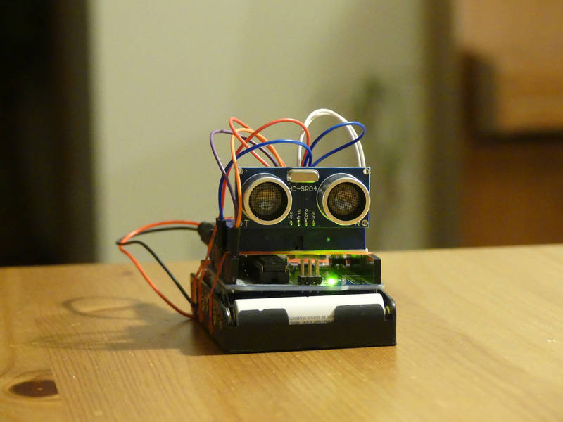

[← zpět na zápisky z Arduino projektů](../index.md)

# Ultrazvukové měření vzdálenosti
Jednoduchý ultrazvukový měřič vzdálenosti se zobrazováním hodnot na OLED displeji.

## Co je potřeba umět
* ovládání OLED displeje **TODO LINK**

## Foto




## Hardware
* OLED displej s I2C, např. [SSD1306](https://www.aliexpress.com/wholesale?catId=0&initiative_id=SB_20170322115850&SearchText=OLED+0.96)
* [ultrazvukové čidlo HC-SR04](https://www.aliexpress.com/wholesale?catId=0&initiative_id=SB_20170322115709&SearchText=hc-sr04)

## Jak to funguje


## Schéma zapojení
[meric_vzdalenosti.fzz](meric_vzdalenosti.fzz)


## Program
[meric_vzdalenosti.ino](meric_vzdalenosti.ino)
``` c++

```
## Možná vylepšení
* Při hodnotě vyšší než 4m zobrazit hlášení, že jsme mimo rozsah.
* Při vzdálenosti nad 1m zobrazovat hodnotu v metrech.

## Poznatky
Trochu nás potrápil protokol I2C, bylo to první setkání. Trvalo nám, než jsme přišli na to, že Uno R3 má I2C natvrdo na pinech A4 a A5. Měření nám fungovalo celkem spolehlivě do jednoho metru, hodně záleží, od čeho se ultrazvuk odráží. Pokud se zapojení udělá rozumně kompaktní, může s ním dítě oběhnout celý dům.