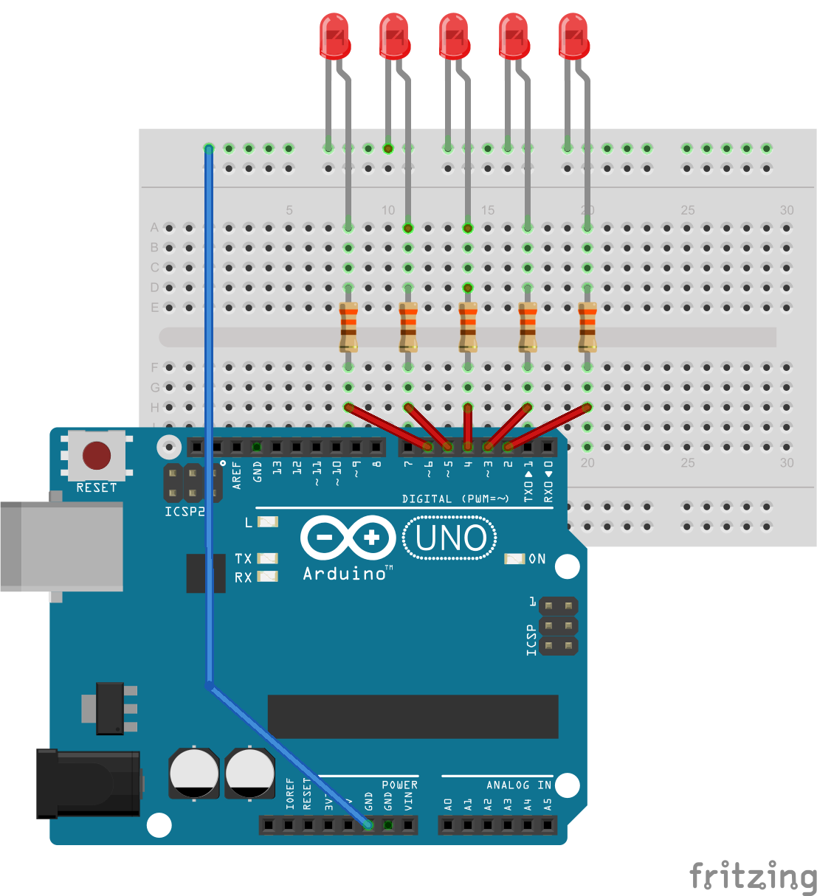

[← zpět na zápisky z Arduino projektů](../index.md)

# K.I.T.T. Night rider
Blikání LED podobné [K.I.T.T. ovi](https://www.google.com/search?q=k.i.t.t.&client=firefox-b&source=lnms&tbm=isch&sa=X&ved=0ahUKEwiKlIyOs-fSAhUDOpoKHY5WBcAQ_AUICCgB&biw=1600&bih=793) Lze naprogramovat i bez cyklů, jen je potřeba u toho více psát.

## Co je potřeba umět
Základy zapojování LED. Základní programové konstrukce pro ovládání digitálních pinů Arduina. Cykly jsou výhodou.
## Foto

## Hardware
* dostatek různě barevných LED, některé se asi spálí
* rezistory 220&nbsp;Ω - 330&nbsp;Ω

## Schéma zapojení
[night_rider.fzz](night_rider.fzz)



## Program
[night_rider.ino](night_rider.ino)
```c++

```
## Možná vylepšení

## Poznatky
<<<<<<< HEAD
Pokud jsou pro děti cykly obtížné (a to často jsou), ničemu nevadí, když kopírují hromady kódu. Časem je to přestává bavit a samy se začínají ptát, zda se to nedá udělat nějak lépe, aby se to pořád nemusel kopírovat. Výše uvedený program s Night riderem v této podobě dítě do 8 let nenapíše. V prvních chvílích není ani tak důležité, aby děti rozuměly všemu, co se v kódu píše, ale aby to blikalo.
=======
Pokud jsou pro děti cykly obtížné (a to často jsou), ničemu nevadí, když kopírují hromady kódu. Časem je to přestává bavit a samy se začínají ptát, zda se to nedá udělat nějak lépe, aby se to pořád nemusel kopírovat. Výše uvedený program s Night riderem v této podobě dítě do 8 let nenapíše. V prvních chvílích není ani tak důležité, aby děti rozuměly všemu, vo se v kódu píše, ale aby to blikalo.
>>>>>>> origin/master
