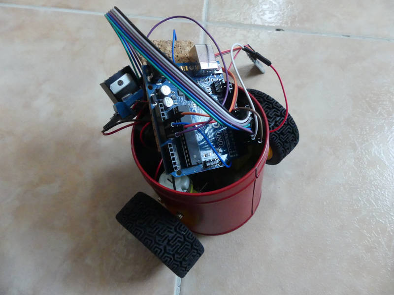
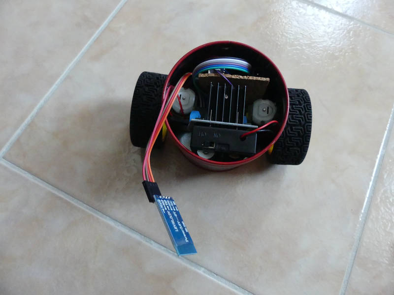
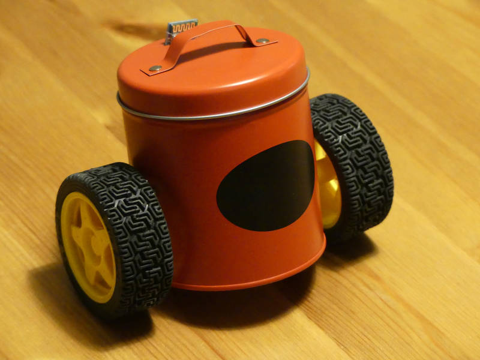
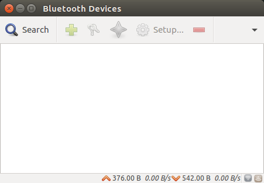
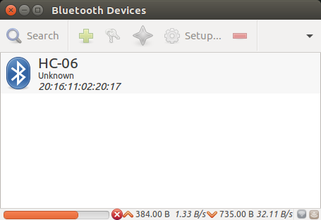
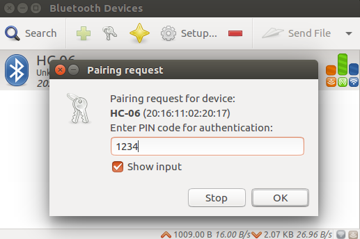

[← zpět na zápisky z Arduino projektů](../../index.md)
[← zpět na Robopixli](../robopixle.md)

# Robopixle ovládaná pomocí Bluetooth z Python konzole
První verze dálkově ovládaného robota, který běhá po zemi. Zatím jen ovládaná pomocí Bluetooth a Python konzole. Do budoucna snad předěláme na něco jiného.

## Co je potřeba umět
* Vrtat vrtačkou do krabice :-)

## Foto






## Video

<div markdown="0">
    <video controls>
        <source src="robopixle_bt.mp4" type="video/mp4">
        Bohužel, váš prohlížeč neumí HTML5 video. <a href="robopixle_bt.mp4">Přehrajte si jej jako soubor.</a>
    </video>
</div>

## Hardware
* Kovová krabička od čaje (nebo jakákoliv jiná, plastová bude taky dobrá a navíc přes ni projde signál)
* 2 motory, použili jsme TT motor ([Aliexpress](https://www.aliexpress.com/wholesale?catId=0&initiative_id=&SearchText=tt+motor))
* 2 kola ([Aliexpress](https://www.aliexpress.com/wholesale?catId=0&initiative_id=SB_20170328123120&SearchText=arduino+wheel))
* Dual motor driver L298N ([Aliexpress](https://www.aliexpress.com/wholesale?catId=0&initiative_id=SB_20170328123156&SearchText=L298N), [specifikace](L298_Data_Sheet.pdf))
* Bluetooth modul, my jsme použili modul HC-06 ([Aliexpress](https://www.aliexpress.com/wholesale?catId=0&initiative_id=SB_20170328123826&SearchText=HC-06), [specifikace](hc_hc-05-user-instructions-bluetooth.pdf))
* Bateriové napájení, my jsme použili 2× Lion 18650 s držákem, který má i vypínač ([Aliexpress](https://www.aliexpress.com/wholesale?catId=0&initiative_id=SB_20170328124149&SearchText=18650+box+switch))
* Pro zabránění zkratu v pixli jsme použili korkovou podložku pod sklenici
* Tento projekt nevyžaduje nepájivé pole, obešli jsme se bez něj (nejspíš by se do pixle nevešlo)

## Jak to funguje
### Bluetooth
Jak už jsem zmínil, Bluetooth byla nouzová bezdrátová technologie, protože cílem bylo do večera daného dne zprovoznit bezdrátově Robopixli a poslední infra sensor jsem nešťastnou náhodou upálil. Wifi modul ani jiné bezdrátové technologie nebyly zrovna po ruce. Současně to ale byla i zajímavá příležitost si Bluetooth modul vyzkoušet, protože jsme s ním nikdy ještě nic nedělali.

#### Bluetooth a Linux
Nejdříve je potřeba zařízení napárovat s počítačem, který ho bude ovládat. Párovali jsme s Linuxem, tedy jsme pro snadnější práci se zařízeními doinstalovali program [Bluetooth manager](https://apps.ubuntu.com/cat/applications/precise/blueman/).
``` bash
sudo apt-get update
sudo apt-get upgrade
sudo apt-get install blueman
```



Tlačítkem search dáme vyhledat zařízení, Robopixle musí být zapnutá, Bluetooth modul modře bliká.



Pravé tlačítko na nalzezeném HC-06, vybrat volbu `pair` (spárovat) a vyplnit pin `1234`.



#### Bluetooth a Python
Pro práci s Bluetooth v Pythonu je potřeba nainstalovat knihovnu PyBluez.
``` python
pip install pybluez
```
Python Program pro ovládání Robopixle [viz níže](#python).

#### Bluetooth a Arduino
Používáme knihovnu [SoftwareSerial](https://www.arduino.cc/en/Reference/softwareSerial) - to proto, aby nebylo nutné při nahrávání kódu do Arduina odpojovat Bluetooth modul - ten totiž blokuje TX/RX piny a hádá se to. [SoftwareSerial](https://www.arduino.cc/en/Reference/softwareSerial) umožňuje Bluetooth připojit na jiné piny Arduina a provozovat sériovou komunikaci tam, je pak možné vše provozovat pohodlně najednou. 

Jen taková nápověda: RX pin Bluetooth modulu přijde zapojit na TX Arduina a TX Bluetooth na RX Arduina. Trochu nás to potrápilo, ale smysl to dává :-)

### L298N dual motor driver
Dvoumotorový řadič, který si poradí i s vyšším napětím. Umožňuje jednoduše ovládat 2 motory nezásvisle oběma směry. Pomocí PWM je možné ovlivňovat i rychlost motorů.

Parametry:
* vstupní napětí: 5&nbsp;V - 46&nbsp;V
* špičkový proud: 2&nbsp;A
* maximální výkon: 25&nbsp;W
* pracovní teplota: -25&nbsp;℃ - +130&nbsp;℃

V našem případě z jeho vstupních svorek přivádíme napětí do Arduina, jelikož to eliminuje nepájivé pole v pixli (a pájení). A to se hodí hlavně z hlediska prostoru.

### Napájení
Krabice pro Robopixli není na výšku dostatečně vysoká, aby mohlo mít Arduino napájení přes konektor (ať už USB nebo jack). Bylo potřeba [prozkoumat jiné možnosti napájení přímo přes piny Arduina](https://www.arduino.cc/en/main/arduinoBoardUno). `-` z baterie jde tedy do `GND` a `+` jde do `Vin` pinu.

## Schéma zapojení
[robopixle_bt.fzz](robopixle_bt.fzz)

[](robopixle_bt_bb.png)

## Program pro Robopixli
[robopixle_bt.ino](robopixle_bt.ino)
``` c++

```

## Program pro ovládací Python konzoli 
<a name="python"></a>
Program pro ovládání je velmi jednoduchý, páruje se automaticky na první zařízení, které na Bluetooth síti nalezne, vůbec neinteraguje s uživatelem, že by mu dával na výběr. Že je spárováno je možné poznat jak na displeji počítače (objeví se výzva k zadávání pohybových příkazů), tak na Robopixli, kde přestane blikat modrá LED Bluetooth modulu a začne trvale svítit.

Ovládání Robopixle probíhá pomocí jednoduchých příkazů sestávajících ze 4 písmen:
* `F` = forward (dopředu), pixle popojede kousek dopředu
* `B` = backward (dozadu), pixle popojede kousek dozadu
* `L` = left (vlevo), pixle se otočí asi o 90° vlevo
* `R` = right (vpravo), pixle se otočí asi o 90° vpravo
* Enter = odeslání sestavy příkazů Robopixli, ta je začne obratem provádět (připravte si místo na podlaze!)
Program se přerušuje pomocí `Ctrl+C`.

[robopixle_bt.py](robopixle_bt.py)
``` c++

```

## Možná vylepšení
Možných vylepšení je mnoho a [chystáme je](../robopixle.md).

## Poznatky
* Jak je nakonec z fotek vidět, je dobré si dopředu vše proměřit, zda se do krabice robopixle vejde. Nám to vyšlo tak tak. Uno je velké, motory také a o driveru motorů s velkým chladičem ani nemluvě.
* Kovová krabice je odolná, ale mistr Farraday se nám smál, když jsme se snažili chytit nějaký signál. Bylo potřeba vyvrtat díru pro Bluetooth modul, aby mohla anténa čouhat ven.
* Motory jsou silné a je potřeba je pomocí PWM trochu brzdit.
* Kola nejsou přímo naproti sobě, takže to mírně zanáší, to lze trochu korigovat rozdílnou rychlostí kol.
* Motory nejsou krokové, takže lze zapomenout na přesný pohyb (robot neoběhne čtverec tak, aby se vrátil do původního místa). Kdyby byly krokové, byly by významně dražší a pomalejší, takže si musíme vybrat. Ukázalo se, že to asi nebude nikomu vadit, robot bude řešit jiný typ úloh.
* Napájení pomocí 2× Lion 18650 dá v plně nabitém stavu asi 8,4&nbsp;V, po nějakém větším trápení dětmi napětí rychle klesá k 7&nbsp;V, z toho si ještě odeberou motory, takže na Arduino zbývá už málo. [Pod 7&nbsp;V je Arduino Uno nestabilní](https://www.arduino.cc/en/main/arduinoBoardUno) (a v reálu se to projevuje tak, že to dělá blbiny, neposlouchá, neslyší a nechce slyšet). Možná vyzkoušíme ještě napájení 9&nbsp;V Lion.
