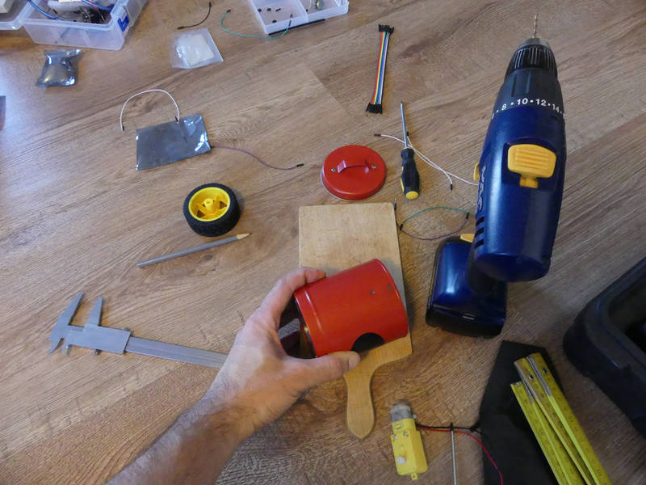
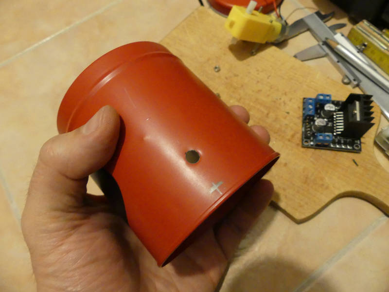
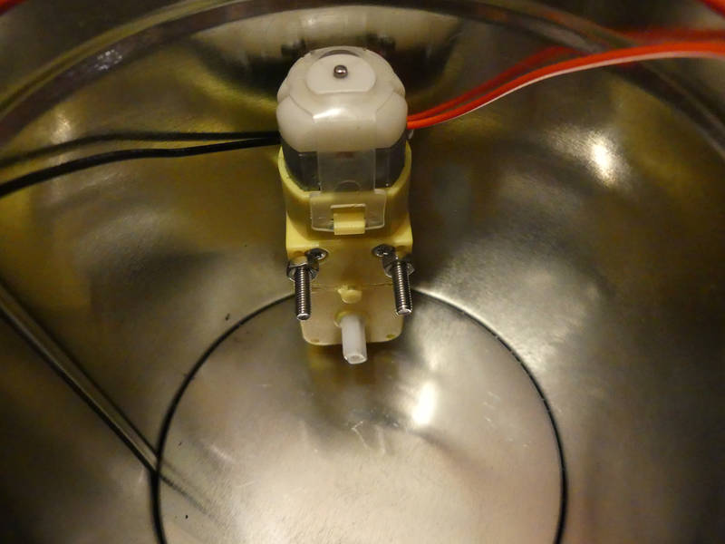
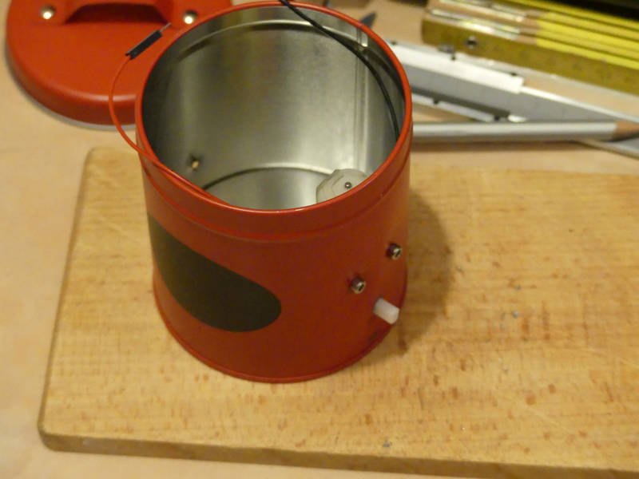
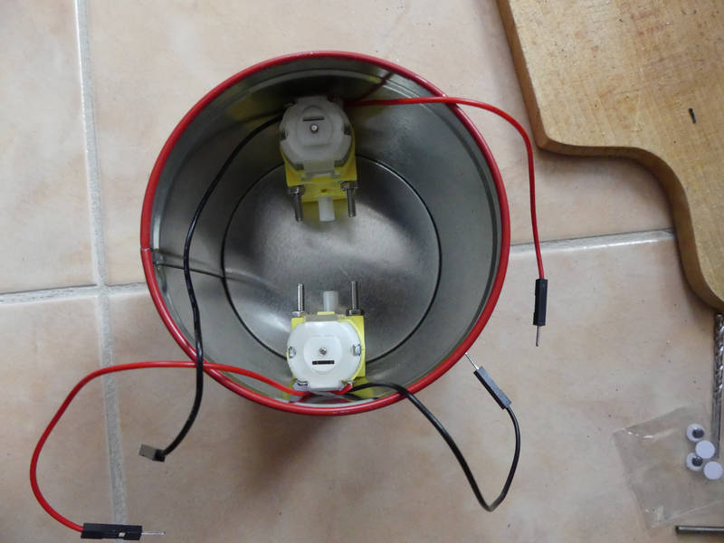
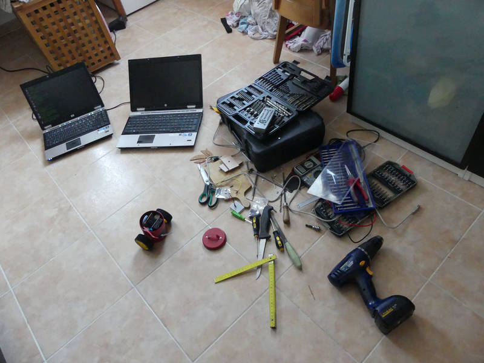
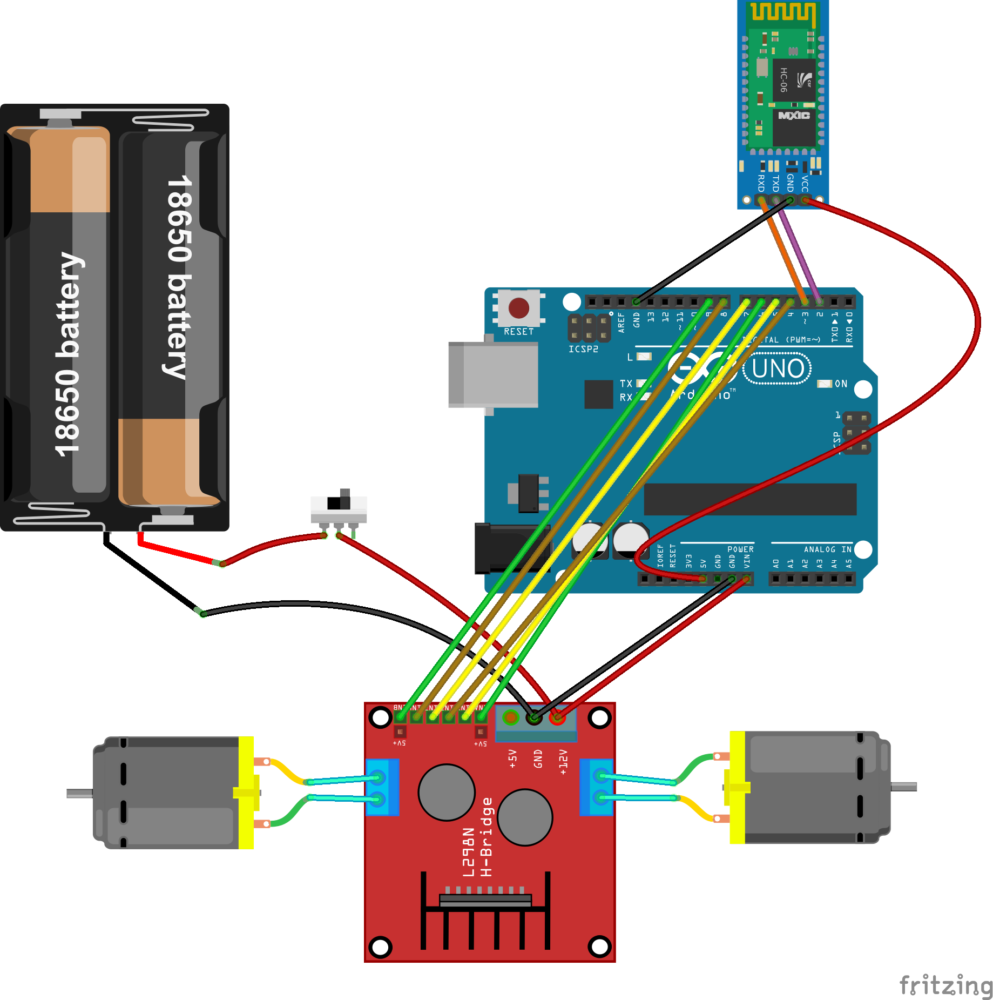

[← zpět na zápisky z Arduino projektů](../../index.md)
[← zpět na Robopixli](../robopixle.md)

# Robopixle ovládaná pomocí Bluetooth z Python konzole

## Co je potřeba umět
* Vrtat vrtačkou do kovové krabice :-)
* 

## Foto








## Video

<div markdown="0">
    <video controls>
        <source src="robopixle_bt.mp4" type="video/mp4">
        Bohužel, váš prohlížeč neumí HTML5 video. <a href="semafor.mp4">Přehrajte si jej jako soubor.</a>
    </video>
</div>

## Hardware
* kovová krabička od čaje
* 2 motory (Aliexpress)
* 2 kola (Aliexpress)
* dual motor driver LN298N (Aliexpress, specifikace)
* Bluetooth modul, my jsme použili 
* bateriové napájení, my jsme použili 2× Lion 18650 s držákem, který má i vypínač (Aliexpress)
* pro zabránění zkratu jsme použili korkovou podložku pod sklenici

## Jak to funguje
Používáme knihovnu [SoftwareSerial](https://www.arduino.cc/en/Reference/softwareSerial) - to proto, aby nebylo nutné při nahrávání kódu do Arduina odpojovat Bluetooth modul - ten totiž blokuje TX/RX piny a hádá se to. [SoftwareSerial](https://www.arduino.cc/en/Reference/softwareSerial) umožňuje Bluetooth připojit na jiné piny Arduina a je tak možné vše provozovat najednou. 

Jen taková nápověda: RX pin Bluetooth přijde zapojit na TX Arduina a TX Bluetooth na RX Arduina. Trochu nás to potrápilo, ale smysl to dává :-)

Krabice pro Robopixli není na výšku dostatečně vysoká, aby mohlo mít Arduino napájení přes konektor (ať už USB nebo jack). Bylo potřeba [prozkoumat jiné možnosti napájení přímo přes piny](https://www.arduino.cc/en/main/arduinoBoardUno). `-` z baterie jde tedy do `GND` a `+` jde do `Vin` pinu.

## Schéma zapojení
[robopixle_bt.fzz](robopixle_bt.fzz)

[](robopixle_bt_bb.png)

## Program pro Robopixli
[robopixle_bt.ino](robopixle_bt.ino)
``` c++

```

## Program pro ovládací Python konzoli
[robopixle_bt.py](robopixle_bt.py)
``` c++

```

## Možná vylepšení
Možných vylepšení je mnoho a [chystáme je](../robopixle.md).

## Poznatky
* Jak je nakonec z fotek vidět, je dobré si dopředu vše proměřit, zda se do krabice robopixle vejde. Nám to vyšlo tak tak. Uno je velké, motory také a o driveru motorů s velkým chladičem ani nemluvě.
* Kovová krabice je dobrá, ale mistr Farraday se nám smál, když jsme se snažili chytit nějaký signál. Bylo potřeba vyvrtat díru pro Bluetooth modul, aby mohla anténa čouhat ven.
* Motory jsou silné a je potřeba je pomocí PWM trochu brzdit.
* Kola nejsou přímo naproti sobě, takže to mírně zanáší, to lze trochu korigovat rozdílnou rychlostí kol.
* Motory nejsou krokové, takže lze zapomenout na přesný pohyb (robot neoběhne čtverec tak, aby se vrátil do původního místa). Kdyby byly krokové, byly by významně dražší a pomalejší, takže si musíme vybrat. Ukázalo se, že to asi nebude nikomu vadit, robot bude řešit jiný typ úloh.
* Napájení pomocí 2× Lion 18650 dá v plně nabitém stavu asi 8,4&nbsp;V, po nějakém větším trápení dětmi napětí rychle klesá k 7&nbsp;V, z toho si ještě odeberou motory, takže na Arduino zbývá už málo. [Pod 7&nbsp;V je Arduino Uno nestabilní](https://www.arduino.cc/en/main/arduinoBoardUno) (a v reálu se to projevuje tak, že to dělá blbiny, neposlouchá, neslyší a nechce slyšet).
