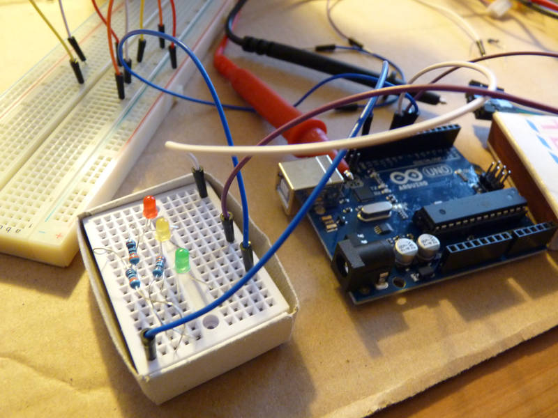
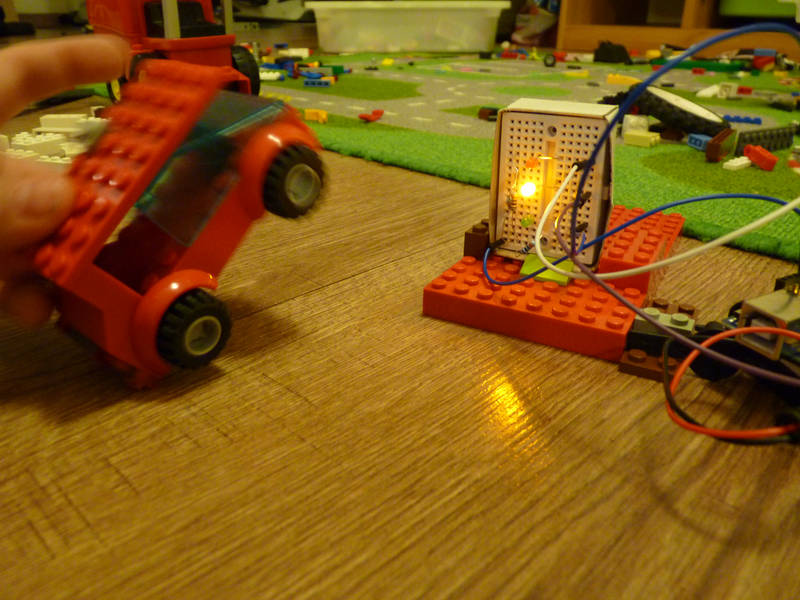
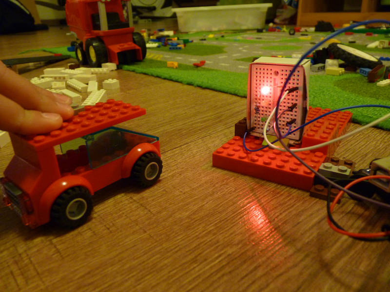
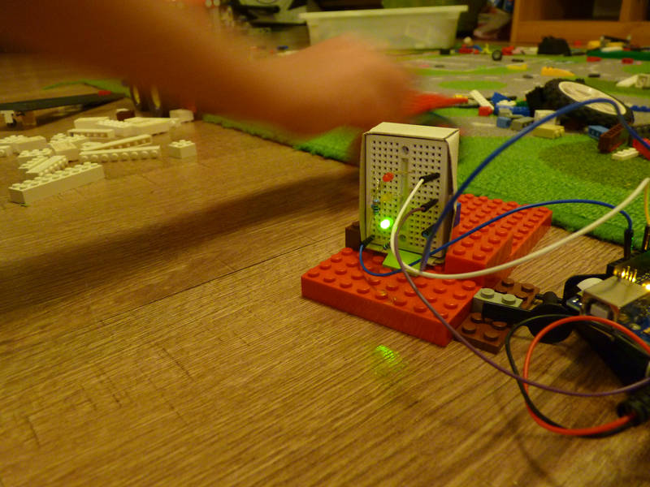
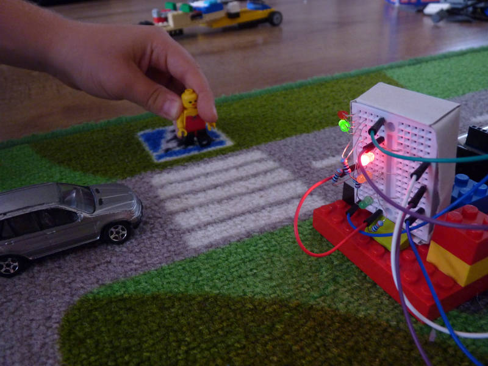
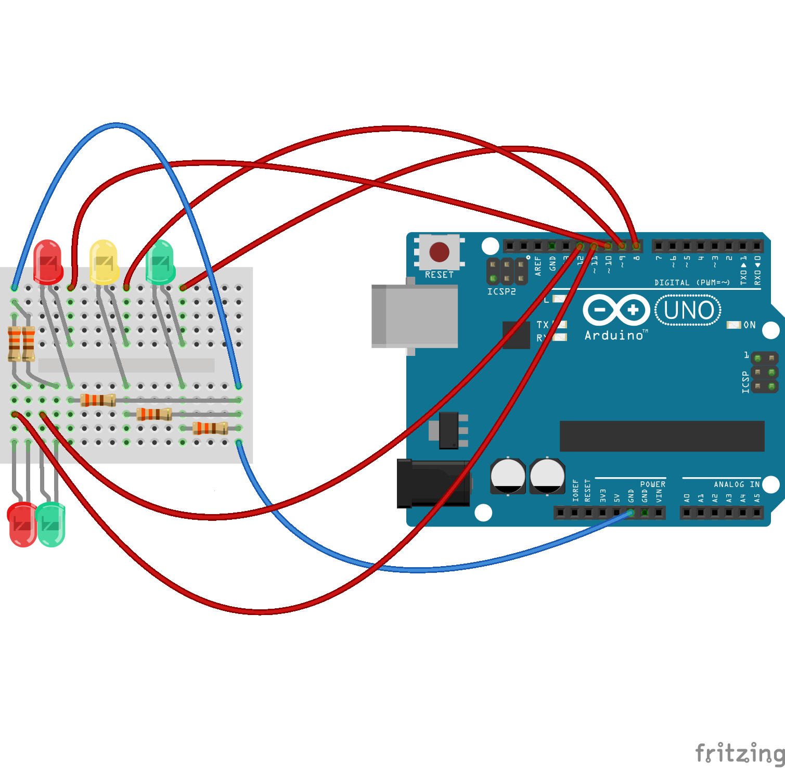

# Semafor
Pokročilejší úloha s využitím LED, samostatně vytvořit semafor. Míru samostatnosti lze regulovat (od zapojení HW přes napsání celého SW apod.) Abychom mohli snadno měnit intervaly pro jednotlivé barvy, zavedli jsme proměnné (v roli konstant). Pro lepší orientaci v kódu využíváme hojně komentáře.

## Co je potřeba umět
* zapojení, ovládání LED
* základní programové konstrukce (podmínky, hodí se i opakování), `HIGH`, `LOW`, `delay()` apod.

## Foto








## Hardware
* Zelené, žluté, červené LED
* Rezistory 220&nbsp;Ω - 330&nbsp;Ω

## Schéma zapojení
[semafor.fzz](semafor.fzz)



## Program
[semafor.ino](semafor.ino) - kód je napsán osmiletým dítětem, obsahuje různá vylepšení standardního semaforu viz níže
``` c++
// jak dlouho ma pockat
int sekunda = 1000;

int casC = 15 * sekunda;
int casOC = 1 * sekunda;
int casO = 2 * sekunda;
int casZ = 12 * sekunda;
int casBlik = 300;
int casCHC = 3 * sekunda;
int pinC = 10;
int pinZ = 8;
int pinO = 9;
int pinCHZ = 12;
int pinCHC = 11;

void setup() {
  pinMode(pinZ, OUTPUT); // zelena
  pinMode(pinO, OUTPUT); // oranzova
  pinMode(pinC, OUTPUT); // cervena
  pinMode(pinCHC, OUTPUT); // chodec cervena
  pinMode(pinCHZ, OUTPUT); // chodec zelena
}

void loop() {
  // rozsvit c ch z
  digitalWrite(pinC, HIGH);
  digitalWrite(pinCHZ, HIGH);
  // cekej
  delay(casC);
  // rozsvit z blik
  for (int i = 0; i < 3; i++) {
    digitalWrite(pinCHZ, HIGH);
    delay(casBlik);
    digitalWrite(pinCHZ, LOW);
    delay(casBlik);
  } // rozsvit ch c
  digitalWrite(pinCHC, HIGH);
  digitalWrite(pinC, HIGH);
  delay(casCHC);

  digitalWrite(pinO, HIGH);
  // cekej
  delay(casOC);
  // zhasni c o
  digitalWrite(pinC, LOW);
  digitalWrite(pinO, LOW);
  // rozsvit z
  digitalWrite(pinZ, HIGH);
  // cekej
  delay(casZ);
  // zhasni z
  digitalWrite(pinZ, LOW);
  // rosvit o
  digitalWrite(pinO, HIGH);
  delay(casO);
  digitalWrite(pinO, LOW);
  // blikani
  delay(casBlik);
  for (int i = 0; i < 5; i++) {
    digitalWrite(pinO, HIGH);
    delay(casBlik);
    digitalWrite(pinO, LOW);
    delay(casBlik);
  }
  digitalWrite(pinCHC, HIGH);
  digitalWrite(pinC, HIGH);
  delay(casCHC);
  digitalWrite(pinCHC, LOW);
}
```
## Možná vylepšení
* Doplnění klasického auto-semaforu ještě o semafor pro chodce.
* Doplnění semaforu(ů) o bezpečnostní chvíle, kdy svítí všude červená (pro přeběhlíky).
* Doplnění semaforu(ů) o blikání před koncem zelené (upozornění, že brzy skočí červená).
* Pro železniční nadšence je možné vyrobit např. nějaké [návěstidlo](https://www.google.com/search?q=odjezdov%C3%A9+n%C3%A1v%C4%9Bstidlo&client=firefox-b&source=lnms&tbm=isch&sa=X&ved=0ahUKEwjeoaqExufSAhVlIpoKHaayDeIQ_AUICCgB&biw=1600&bih=793#tbm=isch&q=odjezdov%C3%A9+n%C3%A1v%C4%9Bstidlo+barvy&*&imgrc=).
* Pro formulové nadšence je možné vyrobit [startovací světla](https://www.google.com/search?q=odjezdov%C3%A9+n%C3%A1v%C4%9Bstidlo&client=firefox-b&source=lnms&tbm=isch&sa=X&ved=0ahUKEwjeoaqExufSAhVlIpoKHaayDeIQ_AUICCgB&biw=1600&bih=793#tbm=isch&q=formula+start+lights&*).

## Poznatky
Zajímavá úloha pro procvičení samostatnosti, protože jak funguje semafor ví každé dítě, takže zadání není třeba příliš vysvětlovat. S výsledkem si lze navíc i vyhrát, pokud se využije malé nepájivé pole a nacpe se do krabičky od zápalek, je celé řešení celkem kompaktní. Mladší děti konči u standardního semaforu, starší ho šperkují.