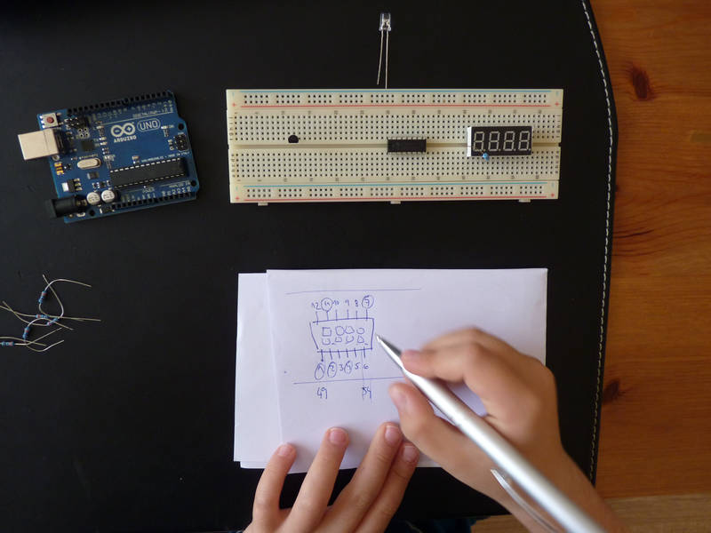
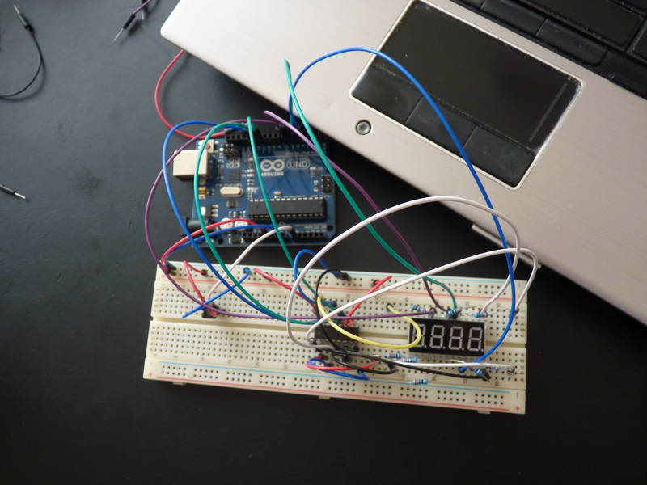
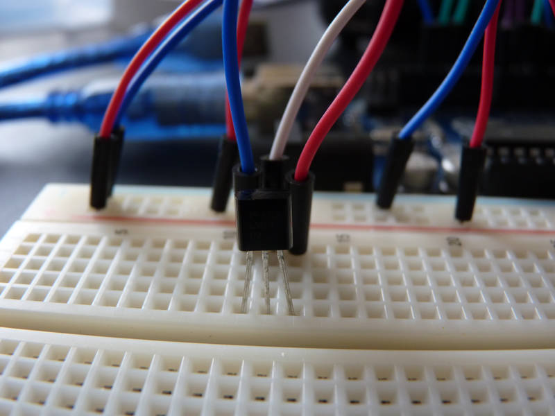

[← zpět na zápisky z Arduino projektů](../index.md)

# Teploměr

## Co je potřeba umět

## Foto







## Hardware
* teploměr LM35
* 4 číslicový 7 segmentový displej (použili jsme 3461BS)
* Posuvný registr 74HC595
* 8 rezistorů 220&nbsp;Ω - 330&nbsp;Ω

## Jak to funguje
### Teploměr LM35
Parametry:
* rozsah od −55°C do 150°C
* přesnost 0,5°C (při 25°C)
* vstupní napětí od 4V do 30V
* < 60 μA
* nízké sebezahřívání (0,08°C)

Teploměr má 3 nožičky, napájení po stranách (+Vs, GND) a výstupní hodnotu na Vout. Ve specifikaci jsem napoprvé nějak přehlédl popisek k rozložení nožiček a zapojil jsem obráceně polaritu. Naštěstí jen na chvíli.

Při pohledu _zespoda_ je +Vs vlevo a GND vpravo. Hodnota pak uprostřed.


### Segmentový displej


### Posuvný registr 74HC595

## Schéma zapojení
[teplomer.fzz](teplomer.fzz)
Zapojení kreslilo 7 leté dítě :-)


## Program
[teplomer.ino](teplomer.ino)
``` c++

```
## Možná vylepšení

## Poznatky
Nejvíce asi zabralo vysvětlování toho, jak jsou ty LED uspořádány uvnitř segmentového displeje. Pak samozřejmě posuvný registr. Následně jsme si málem uškvařili teploměr, protože jsme ho zapojili omylem obráceně :-)
